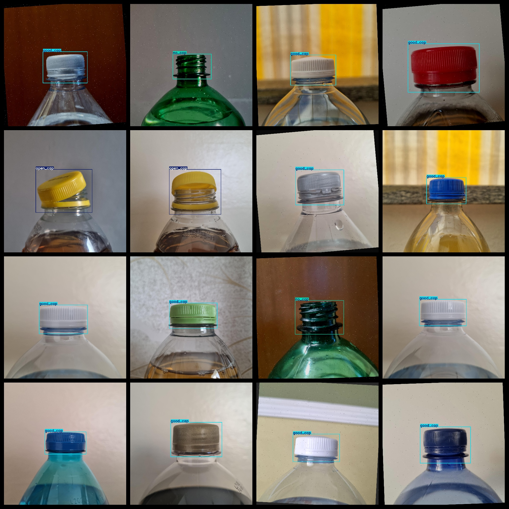
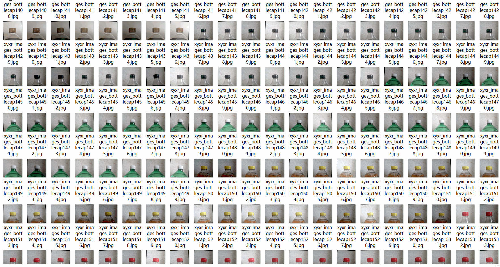

# Mineral springs Water Bottle Lid Defect Detection Dataset 8524 imagesVOC+YOLO

Mineral water bottle cap defect detection dataset 8524 VOCs + YOLOs

Dataset format: Pascal VOC format + YOLO format (the txt file does not contain the split path, it only contains jpg images and corresponding VOC format xml files and yolo format txt files)

Number of images (total jpg file count): 8524

Number of xml files: 8524

Number of txt files: 8,524

Number of categories: 6

The Github repository is: datasets_sl

["damaged_cap", "good_cap", "misplaced_cap", "no_cap", "open_cap", "wet_cap"]

Number of boxes labeled in each category:

Damaged capacitor count = 741

Good Cap Frames = 4848

The number of misplaced caps = 596

No_cap frame count = 648

The number of open caps equals 745.

Wet cap frame count = 946

Total Frames: 8524

Number of images per category:

Damaged Cap Ownership Count = 741

Good cap occupies a total of 4848 images.

Misplaced cap occupies 596

No cap _ occupied picture count = 648

The number of open_cap images occupied = 745

Wet_cap_ownership_of_images = 946

Image resolution: 2048x2048

Use the labeling tool: labelImg

Dataset Augmentation: Yes

Rules for annotation: Draw a rectangle around the category.

Important note: The dataset does not have been divided into training, validation, and testing sets.

Special Disclaimer: This dataset does not guarantee the accuracy of the trained models or weight files.

Annotation and image details are as follows:

## Images

---

Here is a pay link on Stripe (https://buy.stripe.com/3cs8yP7sY87d0vu9AB). Please contact me lonlonago@foxmail.com after funding $89, and I will send you a complete data files, thank you!

